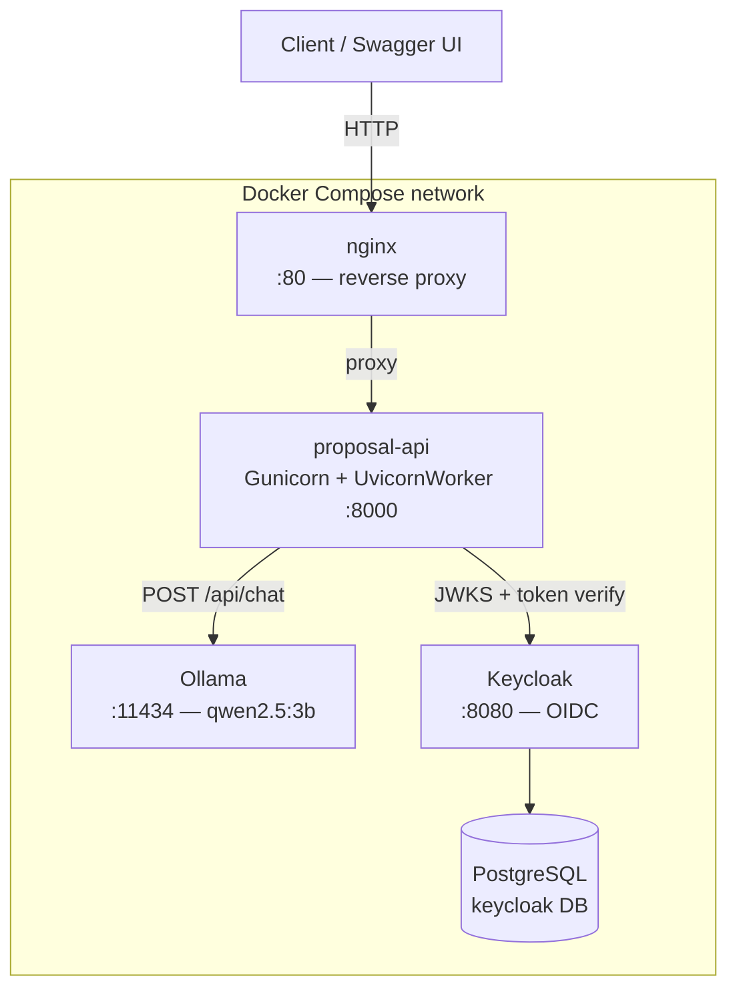
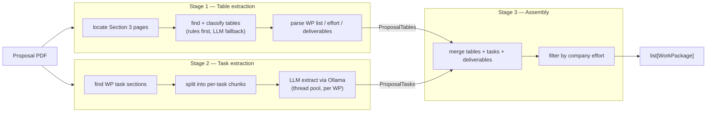
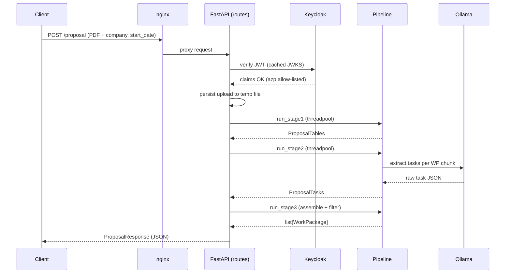
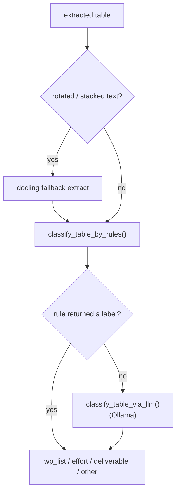

# Architecture

This page documents the runtime topology and the three-stage extraction
pipeline of `proposal-service`. All diagrams are written in
[Mermaid](https://mermaid.js.org/) so they render directly on GitHub and in
the Sphinx docs (see *Rendering in Sphinx* at the bottom).

## 1. Deployment topology

The service runs as a set of Docker Compose containers behind an nginx reverse
proxy. The API talks to Ollama for LLM inference and to Keycloak for token
verification; Keycloak persists to PostgreSQL.



## 2. Three-stage pipeline

A proposal PDF is processed in three independent, separately runnable stages.
Stages 1 and 2 both read the PDF; Stage 3 merges their typed outputs and filters
to the configured company.



## 3. Request lifecycle (`POST /proposal`)

The full pipeline route. Routes stay thin: validate, persist the upload to a
temp file, run each stage in a threadpool so the event loop stays responsive,
then return a typed response model.



## 4. Table classification: rules first, LLM as fallback

A core design principle of Stage 1: deterministic rules decide whenever they
can, and the LLM is consulted only when the rules are unsure. Rules fail
*visibly* (return `None`); the LLM is the costly, less predictable path.



## Rendering in Sphinx

GitHub renders the blocks above automatically. To render them in the Sphinx
build, add the Mermaid extension:

1. Add the dependency to the docs group in `pyproject.toml`:

   ```toml
   [tool.poetry.group.docs.dependencies]
   sphinxcontrib-mermaid = "^1.0"
   ```

2. Enable it in `docs/conf.py`:

   ```python
   extensions = [
       # ... existing extensions ...
       "sphinxcontrib.mermaid",
   ]
   ```

3. Include this page. If you use MyST-Parser, the ` ```mermaid ` fences above
   render as-is. If your docs are pure reStructuredText, convert each fence to a
   directive instead:

   ```rst
   .. mermaid::

      flowchart TB
          client["Client"] --> nginx["nginx :80"]
   ```
